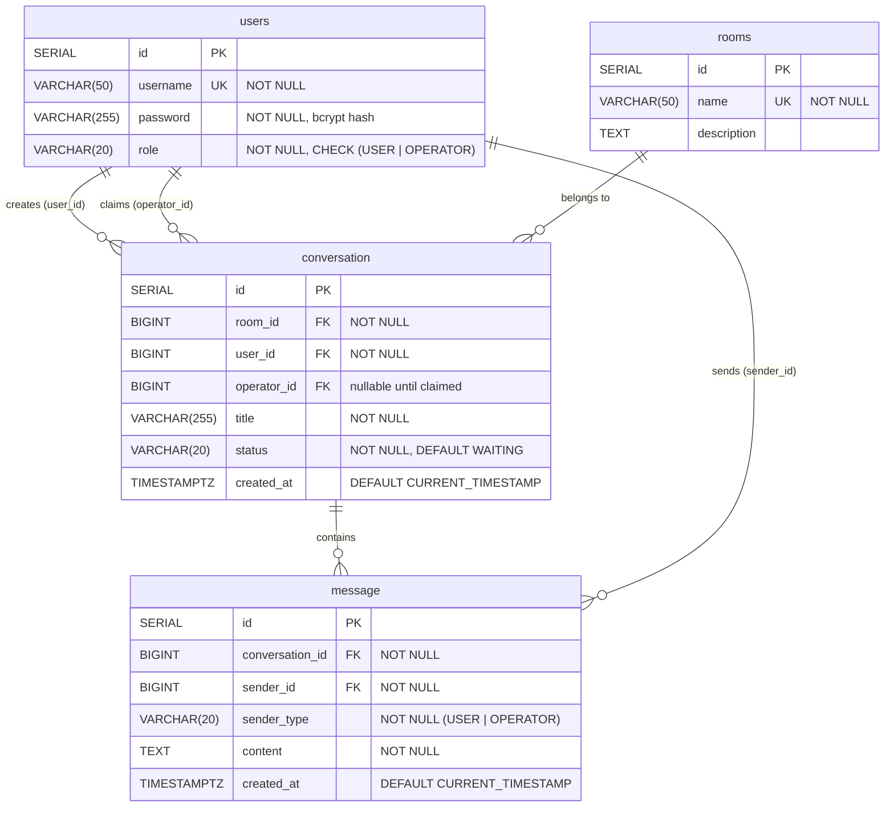
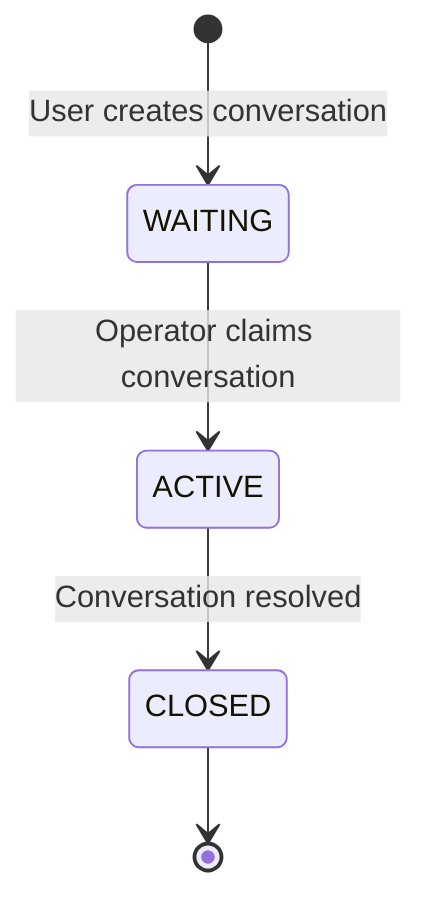

# Database Schema

## Entity-Relationship Diagram

## Conversation Lifecycle

## Table Details

### users

Stores both regular users and operators. The `role` column determines API access.

| Column | Type | Constraints |
|--------|------|-------------|
| `id` | SERIAL | PRIMARY KEY |
| `username` | VARCHAR(50) | UNIQUE, NOT NULL |
| `password` | VARCHAR(255) | NOT NULL (bcrypt hash) |
| `role` | VARCHAR(20) | NOT NULL, CHECK (`USER`, `OPERATOR`) |

### rooms

Predefined support categories that conversations are created under.

| Column | Type | Constraints |
|--------|------|-------------|
| `id` | SERIAL | PRIMARY KEY |
| `name` | VARCHAR(50) | UNIQUE, NOT NULL |
| `description` | TEXT | |

Seeded rooms: `TEHNIKA`, `STORITVE`, `POGOVOR`

### conversation

A support ticket linking a user to a room, optionally assigned to an operator.

| Column | Type | Constraints |
|--------|------|-------------|
| `id` | SERIAL | PRIMARY KEY |
| `room_id` | BIGINT | NOT NULL, FK → `rooms(id)` |
| `user_id` | BIGINT | NOT NULL, FK → `users(id)` |
| `operator_id` | BIGINT | FK → `users(id)`, nullable until claimed |
| `title` | VARCHAR(255) | NOT NULL |
| `status` | VARCHAR(20) | NOT NULL, DEFAULT `WAITING`, CHECK (`WAITING`, `ACTIVE`, `CLOSED`) |
| `created_at` | TIMESTAMPTZ | DEFAULT `CURRENT_TIMESTAMP` |

### message

Chat messages within a conversation, sent by either the user or the operator.

| Column | Type | Constraints |
|--------|------|-------------|
| `id` | SERIAL | PRIMARY KEY |
| `conversation_id` | BIGINT | NOT NULL, FK → `conversation(id)` ON DELETE CASCADE |
| `sender_id` | BIGINT | NOT NULL, FK → `users(id)` |
| `sender_type` | VARCHAR(20) | NOT NULL (`USER` or `OPERATOR`) |
| `content` | TEXT | NOT NULL |
| `created_at` | TIMESTAMPTZ | DEFAULT `CURRENT_TIMESTAMP` |

## Indexes

| Index | Table | Columns | Purpose |
|-------|-------|---------|---------|
| `idx_message_conversation` | message | `conversation_id, created_at` | Fast message polling with `?since=` filter |
| `idx_conversation_status` | conversation | `status` | Fast lookup of WAITING conversations |
| `idx_conversation_operator` | conversation | `operator_id` | Fast lookup of operator's active conversations |

## Migration

Schema is managed by **Flyway**. Migration files are in `src/main/resources/db/migration/`.

| Version | File | Description |
|---------|------|-------------|
| V1 | `V1__init.sql` | Creates all tables, constraints, sequences, and indexes |
